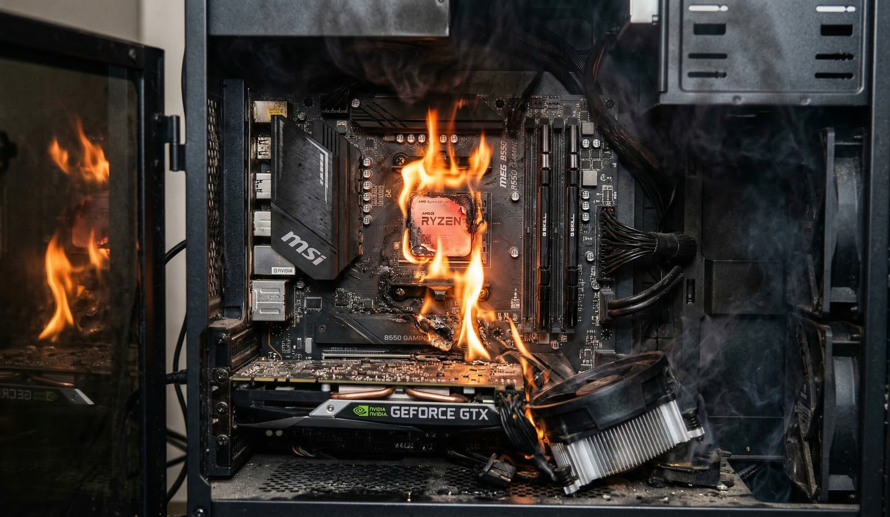

# CPU WARS

## Grupo
### Antônio Gabriel Batista Orrico
### Davi Maltez
### Luis Henrique alves Sampaio Santos
### Luiz Henrique Lins da Costa
### Lucas

> Executar a aplicação no terminal usando o GCC
```bash
gcc main.c -o output
```

> Executar a aplicação no terminal usando o Python
```bash
python archive.py
```




by Roni =]